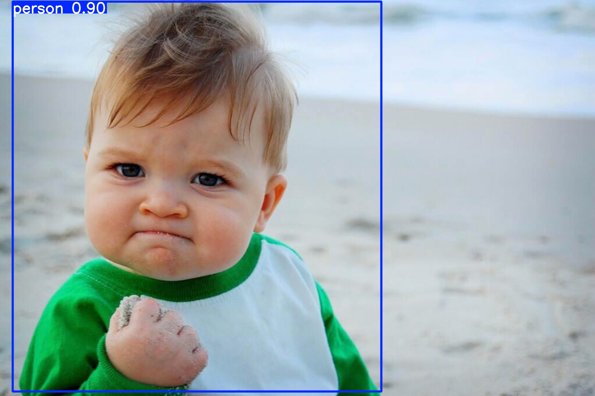

# YOLOv8 Object Detection

Real-time object detection using Ultralytics YOLOv8 with support for image inference and webcam streaming.

## 🚀 Quick Demo

See detection results in the [Example Output](#example-output) section below!

**Key Stats:**
- ⚡ 1.15s inference time on CPU
- 📊 90% detection confidence
- 🎯 Real-time FPS tracking
- 💾 Auto-save annotated outputs

---

## Features

- Detect objects in static images
- Real-time webcam object detection with live FPS display
- **Professional logging system** with timestamped output
- **Performance metrics**: FPS and inference time tracking
- **Save outputs**: Export annotated images and videos
- **YAML configuration support** for reproducible experiments
- Modular code structure (`src/main.py`)
- Organized project layout for ML workflows
- Uses Ultralytics YOLOv8 (Nano version by default)
- Reproducible environment via `requirements.txt`
- Designed for use with VS Code and virtual environments
- Easy to extend (tracking, fine-tuning, UI apps, etc.)

---

## Project Structure
```
yolov8-object-detection/
├── src/
│   └── main.py          # Main detection script with logging & metrics
├── examples/            # Demo images showing input/output
│   ├── input_example.jpg
│   └── output_example.jpg
├── data/
│   ├── images/          # Input images (gitignored)
│   └── videos/          # Input videos (optional, gitignored)
├── outputs/             # Saved detection results (auto-created, gitignored)
├── config.yaml          # Configuration file for parameters
├── requirements.txt     # Minimal core dependencies
├── .gitignore           # Comprehensive Python/ML exclusions
└── README.md
```

---

## Installation & Setup

### 1. Clone the repository
```bash
git clone git@github.com:YOUR_USERNAME/YOUR_REPO_NAME.git
cd YOUR_REPO_NAME
```

### 2. Create and activate a virtual environment
```bash
python3 -m venv .venv
source .venv/bin/activate
```

### 3. Install dependencies
```bash
pip install -r requirements.txt
```

If you don't have a `requirements.txt` yet, generate one:
```bash
pip install ultralytics opencv-python
pip freeze > requirements.txt
```

---

## Usage

### Quick Start with Config File

The easiest way to run the application:

```bash
# Edit config.yaml with your preferences, then:
python -m src.main --config config.yaml
```

### Run Object Detection on an Image

Place an image inside `data/images/`, then run:
```bash
python -m src.main --mode image --image data/images/memekid.jpg
```

**Save the annotated output:**
```bash
python -m src.main --mode image --image data/images/memekid.jpg --output outputs/
```

YOLOv8 will:
- Load the image
- Detect objects
- Log results with timestamps to the terminal
- Display inference time
- Show an annotated window
- Save the result to `outputs/` (if specified)

Press any key to close the window.

### Run Real-Time Webcam Detection

```bash
python -m src.main --mode webcam
```

**Record webcam detection to video:**
```bash
python -m src.main --mode webcam --output outputs/
```

This will:
- Open your default webcam
- Run YOLOv8 on each frame
- Draw bounding boxes and labels
- **Display live FPS and inference time on screen**
- Save video to `outputs/` (if specified)

Press `q` to exit.

---

## Available Arguments

| Argument | Description | Default |
|----------|-------------|---------|
| `--config` | Path to YAML config file | None |
| `--mode` | `image` or `webcam` | `image` |
| `--model` | Path to YOLO model file (`.pt`) | `yolov8n.pt` |
| `--image` | Image path for image mode | `data/images/street.jpg` |
| `--conf` | Confidence threshold | `0.5` |
| `--cam-index` | Webcam device index | `0` |
| `--output` | Directory to save outputs | None |
| `--verbose` | Enable verbose logging | `False` |

**Examples:**
```bash
# Use config file
python -m src.main --config config.yaml

# High-accuracy image detection with saved output
python -m src.main --mode image --model yolov8s.pt --conf 0.6 --output outputs/

# Webcam detection with verbose logging
python -m src.main --mode webcam --verbose --output outputs/
```

---

## Example Output

### Visual Results

**Input Image** → **Detection Output**

<table>
<tr>
<td></td>
<td></td>
</tr>
<tr>
<td align="center">Original Image</td>
<td align="center">YOLOv8 Detection (1 person detected)</td>
</tr>
</table>

### Terminal Output (Actual Run)

```
2025-12-31 14:39:11 - INFO - Starting YOLOv8 Object Detection in image mode
2025-12-31 14:39:11 - INFO - Loading model: yolov8n.pt
2025-12-31 14:39:11 - INFO - Running inference on image: data/images/memekid.jpg
2025-12-31 14:39:12 - INFO - Inference completed in 1.150s
2025-12-31 14:39:12 - INFO - Detected: person with confidence 0.90
2025-12-31 14:39:12 - INFO - Total detections: 1
2025-12-31 14:39:12 - INFO - Saved annotated image to: outputs/memekid_detected_20251231_143912.jpg
2025-12-31 14:39:12 - INFO - Press any key to close the window...
```

### Performance Metrics

| Metric | Value |
|--------|-------|
| Model | YOLOv8n (Nano) |
| Inference Time | 1.150s |
| Detections | 1 person @ 90% confidence |
| Image Size | 176KB input → 302KB annotated |

### Webcam Mode Features

- **Live FPS counter** displayed on screen
- **Inference time** per frame (in milliseconds)
- **Bounding boxes** with class labels and confidence scores
- **Optional video recording** to outputs directory

An annotated detection window will appear automatically in both modes.

---

## Tech Stack

- Ultralytics YOLOv8
- OpenCV (cv2)
- Python 3.10+
- VS Code (recommended)
- GitHub SSH workflow

---

## Future Enhancements (Roadmap)

- Add object tracking (ByteTrack or DeepSORT)
- Add a Streamlit or Gradio UI
- Export detection results to a log file
- Model performance comparison (YOLOv8n, YOLOv8s, YOLOv8m)
- Fine-tune YOLO on a custom dataset
- Add a Dockerfile for deployment
- Create a HuggingFace Spaces demo

---

## License

MIT License (optional)

---

## Contributing

Pull requests are welcome. For major changes, open an issue to discuss details before submitting a PR.

---

## Support

If you find this project helpful, consider starring the repository.